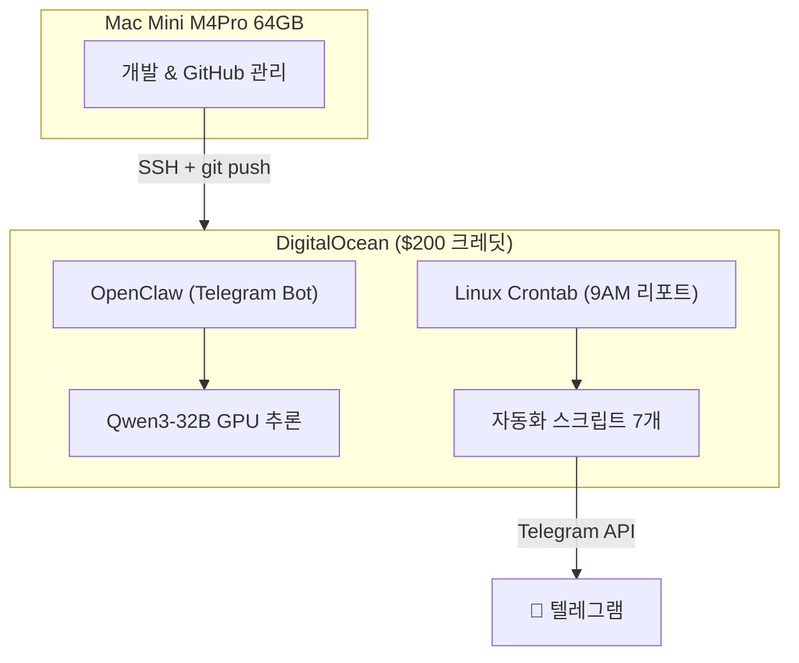
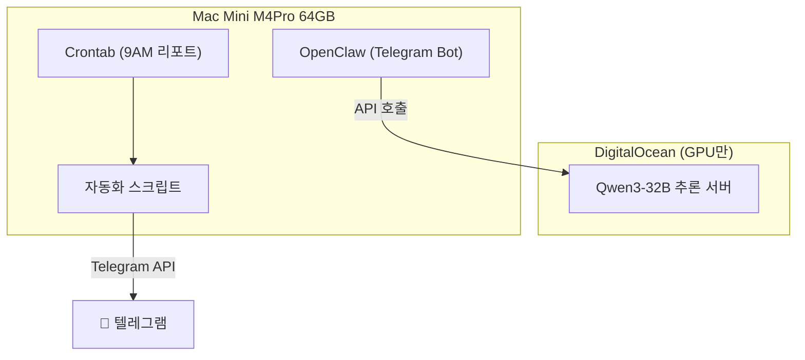

# 🚀 서버 마이그레이션 매뉴얼
## DigitalOcean → Mac Mini (로컬) 이전 가이드

---

## 현재 아키텍처



## 마이그레이션 후 아키텍처



> [!IMPORTANT]
> GPU 추론은 로컬 Ollama가 너무 느리므로 **클라우드에 유지**합니다. 자동화 스크립트만 로컬로 이전합니다.

---

## One-Click 마이그레이션 절차

### Step 1: 백업 (30초)
```bash
chmod +x backup_server.sh
./backup_server.sh
```
- `~/studio-server-backup/YYYYMMDD_HHMMSS/` 에 전체 백업 생성
- 포함: 설정, 인증정보, 스크립트, 크론, 순위 히스토리

### Step 2: 로컬 배포 (3분)
```bash
chmod +x deploy_local.sh
./deploy_local.sh ~/studio-server-backup/YYYYMMDD_HHMMSS
```
- Python venv + Playwright + Chromium 자동 설치
- 스크립트 경로를 로컬용으로 자동 패치
- Crontab 매일 9시 자동 등록

### Step 3: OpenClaw 설치 (5분)
```bash
# OpenClaw 설치
curl -fsSL https://get.openclaw.ai | bash

# 설정 복원
cp ~/studio-server-backup/latest/openclaw-config.tar.gz ~/
cd ~ && tar xzf openclaw-config.tar.gz

# GPU 서버 연결 (DigitalOcean의 추론 서버 유지)
openclaw configure
# → 프로바이더에 gradient 서버 URL 입력
```

### Step 4: 테스트
```bash
# 리포트 수동 실행
~/.studio-automation/venv/bin/python ~/.studio-automation/scripts/daily_report.py

# OpenClaw 봇 상태 확인
openclaw status
```

### Step 5: DO 서버 크론/스크립트 비활성화
```bash
ssh -i ~/.ssh/id_ed25519_agent root@104.248.144.183 "crontab -r -u openclaw"
```

---

## 백업 파일 목록

| 파일 | 내용 | 크기 |
|---|---|---|
| `openclaw-config.tar.gz` | 인증정보, SOUL.md, 크론 작업 | ~50KB |
| `skills.tar.gz` | Python 스크립트 7개 + 스킬 설정 | ~180KB |
| `crontab.txt` | Linux 크론 설정 | ~100B |
| `rank_history.json` | 순위 추적 히스토리 | ~5KB |
| `cron-jobs.json` | OpenClaw 크론 작업 | ~3KB |

---

## 필요 조건 (Mac Mini)

- [x] Python 3.12+ (macOS 기본 제공)
- [x] Git
- [x] Node.js 18+ (OpenClaw 요구)
- [ ] Homebrew (없으면 설치 필요)

## 롤백 방법

로컬에서 문제 발생 시 DO 서버로 즉시 복귀:
```bash
# DO 서버 크론 복원
ssh -i ~/.ssh/id_ed25519_agent root@104.248.144.183 \
  "echo '0 9 * * * python3 /home/openclaw/.openclaw/skills/seo-optimizer/scripts/daily_report.py >> /home/openclaw/.openclaw/logs/daily_report.log 2>&1' | crontab -u openclaw -"
```
